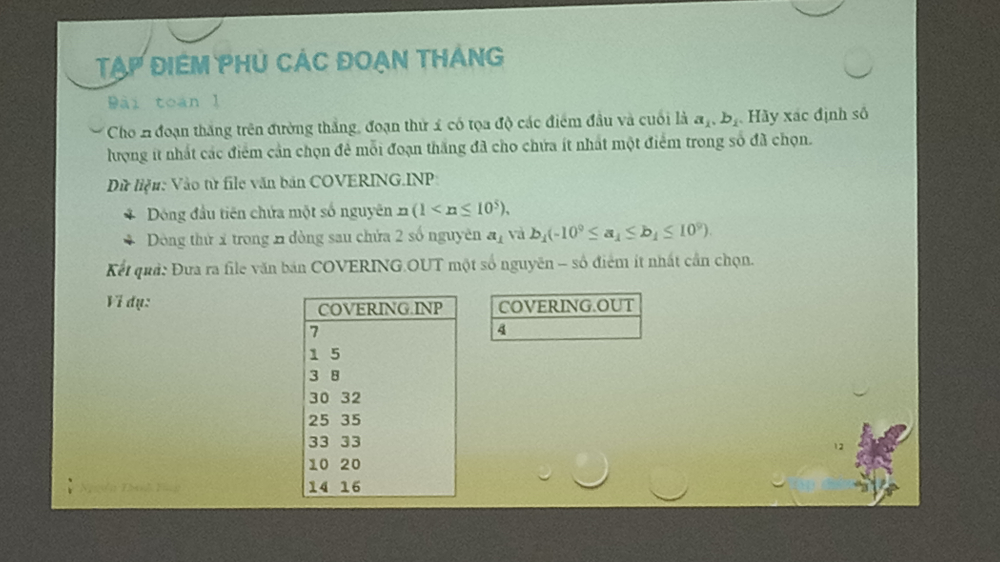

# Bài toán phủ đoạn thẳng

Có n đoạn thẳng. Đoạn thẳng thứ i chiếm [ai, bi].
In ra số lượng điểm ít nhất để phủ tất cả n đoạn thẳng.

---

## Approach 1: Dùng Priority Queue (Greedy)

**Ý tưởng:**

- Sắp xếp các đoạn thẳng theo điểm bắt đầu
- Dùng min_heap để lưu các điểm kết thúc của các đoạn thẳng đang "active"
- Khi gặp đoạn thẳng mới mà điểm bắt đầu > min_heap.top(), nghĩa là cần thêm một điểm phủ

**Thuật toán:**

```
1. Sắp xếp các đoạn thẳng theo ai tăng dần
2. Dùng min_heap để lưu các bi
3. Với mỗi đoạn thẳng [ai, bi]:
   - Nếu ai > min_heap.top(): cần thêm điểm phủ
     + ans++
     + Xóa hết heap
   - Thêm bi vào heap
4. Nếu heap không rỗng: ans++
```

**Ví dụ:**

```
Input: 7 đoạn thẳng
1 5
3 8
10 20
14 16
25 35
30 32
33 33

Xử lý:
- Xét [1,5]: pq = {5}
- Xét [3,8]: 3 <= 5, pq = {5,8}
- Xét [10,20]: 10 > 5, ans=1, pq = {20}
- Xét [14,16]: 14 <= 20, pq = {16,20}
- Xét [25,35]: 25 > 16, ans=2, pq = {35}
- Xét [30,32]: 30 <= 35, pq = {32,35}
- Xét [33,33]: 33 > 32, ans=3, pq = {33}
- Kết thúc: ans=3
```

---

## Approach 2: Event-based Algorithm (covering_master.cpp)

**Ý tưởng chính:**

- Coi mỗi đoạn thẳng [ai, bi] như 2 sự kiện: "bắt đầu" tại ai và "kết thúc" tại bi
- Sắp xếp tất cả sự kiện theo tọa độ
- Duyệt qua các sự kiện theo thứ tự:
  - Khi gặp sự kiện "bắt đầu": thêm đoạn thẳng vào danh sách active
  - Khi gặp sự kiện "kết thúc": kiểm tra xem đoạn thẳng đó đã được phủ chưa
    - Nếu chưa được phủ: đặt một điểm tại vị trí này để phủ tất cả đoạn thẳng đang active

**Chi tiết thuật toán:**

1. Tạo 2n sự kiện: (ai, 0, i) và (bi, 1, i) cho mỗi đoạn thẳng i
2. Sắp xếp các sự kiện theo tọa độ
3. Duy trì:
   - `flg[i]`: đánh dấu đoạn thẳng i đã được phủ
   - `v[]`: danh sách các đoạn thẳng đang active
4. Với mỗi sự kiện:
   - Nếu là "bắt đầu": thêm vào danh sách active
   - Nếu là "kết thúc" và đoạn thẳng chưa được phủ:
     - Đặt điểm phủ tại vị trí hiện tại
     - Đánh dấu tất cả đoạn thẳng active đã được phủ
     - ans++

**Độ phức tạp:** O(n²) do việc đánh dấu tất cả đoạn active trong trường hợp xấu nhất.
