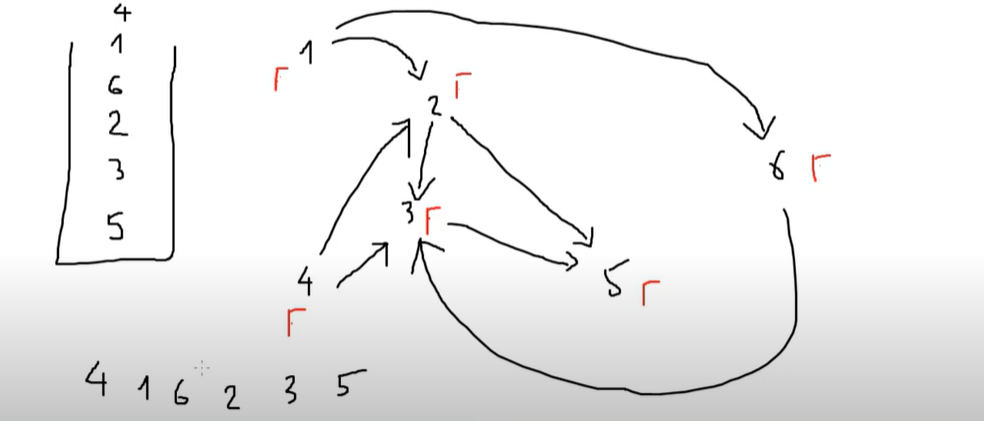
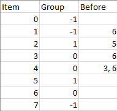
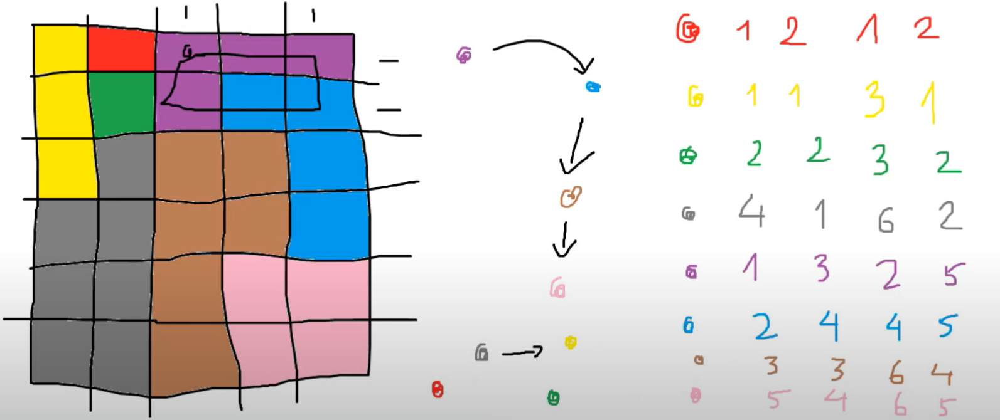

# Sắp xếp Topo

## Bài toán

Cho N công việc, chúng có M ràng buộc với nhau.

Một ràng buộc gồm 2 công việc u và v với ý nghĩa: Để hoàn thành công việc v, ta phải thực hiện công việc u trước.

**Hỏi:** Liệu có tồn tại một cách sắp xếp các công việc sao cho nếu ta thực hiện từng công việc theo thứ tự từ trái sang phải thì toàn bộ các ràng buộc đều thỏa mãn hay không?

---

## Course Schedule

**Nhận xét:** Để đồ thị có thứ tự topo thỏa mãn thì điều kiện bắt buộc là đồ thị phải là đồ thị DAG.

Nếu đây không phải là đồ thị DAG &rarr; IMPOSSIBLE

Tạo một stack `st`



```plaintext
dfs(u):
    visited[u] = true
    for mọi v kề với u
        neu visited[v] == false:
            dfs(v)
    đưa u vào st

hàm main() :
    for u: 1 -> n
        nếu visited[u] == false:
            dfs(u)
    đưa ra các đỉnh trong stach;
```

---

## Longest Path

Cho một đồ thị DAG, hãy tìm một đường đi có độ dài dài nhất.

### Sử dụng quy hoạch động

Gọi `f[u]` là độ dài đường đi dài nhất khi xét đường kết thúc tại u.

Khởi tạo các `f[u] = 0`

Với mỗi `f[u]`, ta xét mọi đỉnh v kề với u, `f[v] = max(f[v], f[u] + 1)```

Kết quả: `max(f[u])`

```plaintext
for u: 1 -> n
    for mọi v kề với u:
        f[v]= max(f[v], f[u] +1)
```

**Nhận xét:** Cách làm trên sẽ không đúng khi đỉnh u -> v nhưng u > v

Ta phải đưa ra một thứ tự sắp xếp sao cho nếu có cạnh u -> v thì u phải đứng trước, v đứng sau.

Ta đưa ra thứ tự topo

```plaintext
for i: 0 -> n - 1
    đặt u = topo[i]
    for mọi v kề với u
        f[v]= max(f[v], f[u] +1)
```

---

## Sort items by groups



Ta hãy cho các item tự do được ở trong những nhóm mới, mỗi nhóm có 1 phần tử

```
0: 2
1: 3
2: 1
3: 0
4: 0
5: 1
6: 0
7: 4
```

6, 4, 1, 3, 5, 0, 2, 7

- Nhóm 0 ----> Nhóm 3
- Nhóm 0 ----> Nhóm 1

Nhóm 0 -- > Nhóm 3 -- > Nhóm 1 -- > Nhóm -- > Nhóm 4

- Nhóm 0: 6, 4, 3
- Nhóm 3: 1
- Nhóm 1: 5, 2
- Nhóm 2: 0
- Nhóm 4: 7

6, 4, 3, 1, 5, 2, 0, 7

---

WC1 tô màu


