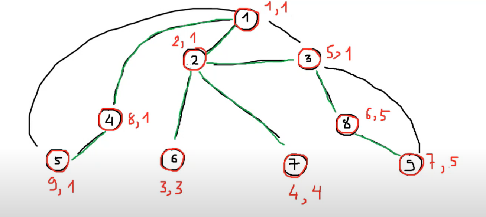
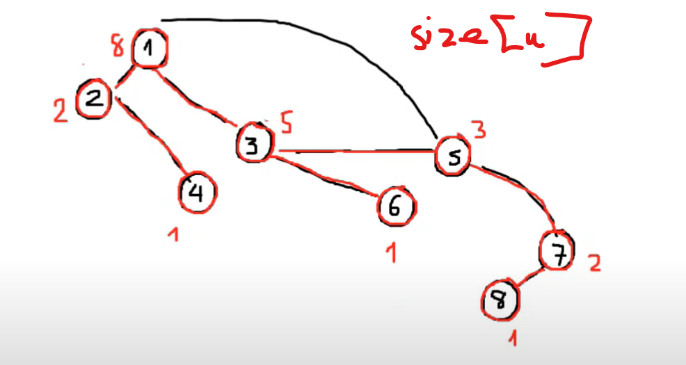
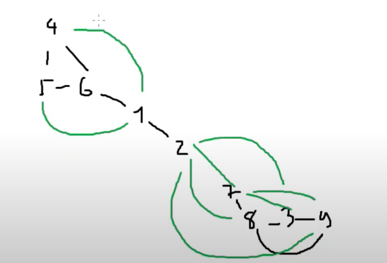
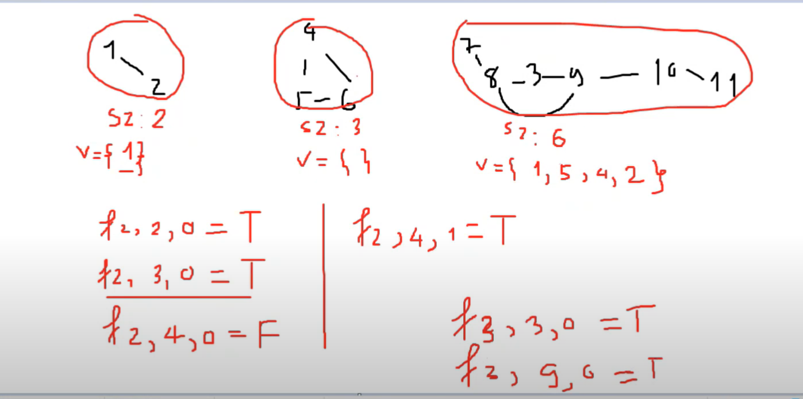

# Joints And Bridges

Cho một đồ thị vô hướng gồm **N** đỉnh, **M** cạnh.  
Hãy đếm có bao nhiêu **cầu** và bao nhiêu **khớp**.

- **Cầu**: Một cạnh sao cho khi xóa cạnh này, đồ thị sẽ tách thành nhiều thành phần liên thông hơn.
- **Khớp**: Một đỉnh sao cho khi xóa đỉnh này, đồ thị được tách thành nhiều thành phần liên thông hơn.

---

## Cây DFS

Là một cây thể hiện việc duyệt qua các cạnh theo thuật toán DFS.

---

## Thuật toán tìm cầu



Ta gọi 2 bảng `numb` và `low` với ý nghĩa:

- `numb[u]`: thứ tự duyệt DFS khi ta đứng tại u
- `low[u]`: thứ tự numb nhỏ nhất có thể mà ta có thể gặp lại

```plaintext
timeDfs = 0
dfs(u, father)
    numb[u] = low[u] = ++ timeDfs
    duyệt mọi đỉnh v kề với u
        nếu v == father
            continue
        nếu numb[v] > 0:
            low[u] = min(low[u], numb[v])
        else:
            dfs(v, u)
            low[u] = min(low[u], low[v])
            nếu numb[v] == low[v]:
                đưa cạnh u - v vào danh sách cầu.
```

---

## Tìm khớp

Nhận xét: u là khớp nếu tồn tại một đỉnh con v sao cho `low[v] >= num[u]`

Ta tạo bảng `isJoint[u] = true / false` với ý nghĩa u có phải là khớp hay không.

```plaintext
timeDfs = 0
dfs(u, father)
    timeDfs ++
    numb[u] = low[u] = timeDfs
    children = 0
    duyệt mọi đỉnh v kề với u
        nếu v == father
            continue
        nếu numb[v] > 0:
            low[u] = min(low[u], numb[v])
        else:
            dfs(v, u)
            children++
            low[u] = min(low[u], low[v])
            nếu u == 1 và children >= 2:
                isJoint[u] = true
            else nếu u != 1:
                nếu low[v] >= numb[u]:
                    isJoint[u] = true
```

---

### main():

```plaintext
dfs(1, -1)
duyệt mọi u: 1 -> n
    nếu isJoint[u] == true
```

---

## Bài toán sửa cầu

Cho 1 cây, có M lần đi sửa cầu, đi sửa lần lượt các cạnh từ u->v.  
Sau khi sửa m lần, còn bao nhiêu cạnh chưa được sửa?

---

Sửa cạnh x đến y; tạo cạnh x->y; đếm xem có bao nhiêu cầu.

Ở testcase 7: có cạnh 1->10, cạnh 1-10 đã sửa; thì 1-10 vẫn là cầu.

-> Tạo `unordered_map {{u,v},t}`; cạnh u,v đã được sửa -> không tính cạnh {u,v} là cầu.

---

## Weather


n đỉnh, m cạnh

Đếm cạnh: xét A->B đếm có bao nhiêu cạnh xóa đi mà không thể đi từ A->B.

Tính tổng cạnh khi xét tất cả cặp đỉnh.

---

Nhận xét: những cạnh phải xóa là cầu.

Thay đổi bài toán:

- Bài toán gốc: xét mọi cạnh {u,v} đếm có bao nhiêu cầu, sau đó tính tổng số cầu.
- Bài toán mới: xét mỗi cầu, đếm số cặp đỉnh không tới được với nhau khi xóa cầu, sau đó tính tổng.

Gọi `size[u]` là số lượng đỉnh trên cây có gốc là u.

---

## Dumbell



Ta định nghĩa "đồ thị hình quả tạ" là một đồ thị cấu trúc như sau:

- Là một đồ thị vô hướng, gồm 1 thanh chắn ngang và 2 phần được nối bằng thanh này là 2 đồ thị đầy đủ.

Cho một đồ thị ban đầu gồm N đỉnh, M cạnh.  
Ta cần tạo ra đồ thị hình quả tạ bằng cách thêm một số cạnh vào.  
Hỏi số cạnh ít nhất cần thêm vào là bao nhiêu?

---

Nhận xét: cấu trúc hình quả tạ:

- Bên trái: x đỉnh
- Bên phải: n-x đỉnh

Một đồ thị đầy đủ x đỉnh, mỗi đỉnh sẽ nối với (x-1) đỉnh còn lại

===> `left = x(x-1)/2` cạnh

bên phải tương tự

===> `right = (n-x)(n-x-1)/2`

Thanh ngang: 1

Tổng cạnh: `x(x-1)/2 + (n-x)(n-x-1)/2 + 1`

Tổng số cạnh cần bổ sung: `x(x-1)/2 + (n-x)(n-x-1)/2 + 1 - M`

---

### Quy hoạch động



v: {tập x}; sz: kích thước tplt

Gọi `f[i][j][state]` có thể hay không thể chọn 1 đồ thị:

- chọn i thành phần liên thông.
- bên trái có j đỉnh
- state = 0; không sử dụng cầu làm thanh quả tạ. state = 1; sử dụng cầu làm thanh quả tạ.

Bài toán cơ sở: `f[0][0][0] = 0`

Xét thành phần liên thông i+1:

- Không chấp nhận tplt i+1: vào trong vùng có j đỉnh  
   `f[i+1][j][state] = true`
- Chấp nhận tplt i+1: vào trong vùng có j đỉnh  
   `f[i+1][j + size[i+1]][state] = true`
- Nếu state == 1 && v[i+1] != rỗng  
   Nếu ta chọn số lượng đỉnh sau khi tách tplt thứ i+1 là v[i+1][k]  
   `f[i+1][j+ v[i+1][k]] [1] = true`

Đáp án bài toán:  
x được tạo nếu `f[nComponents][x][0] == true || f[nComponents][x][1]==true`

---

### Quy hoạch động chuẩn

Gọi `f[i][state]` là tập hợp những giá trị x khi chọn và không chọn một vài tp liên thông ban đầu và trạng thái state.

- state = 0: ta chưa chọn bất kỳ cạnh nào làm thanh quả tạ
- state = 1: ta đã chọn 1 cạnh nào đó làm thanh quả tạ rồi.

Ta lưu `f[i][state]` như là các bitset, mỗi bitset gồm 100000 bit.

Bài toán cơ sở: `f[0][0].set(0, 1)`

Công thức QHĐ:

Với `f[i][state]`, xét thành phần liên thông thứ i+1

1. Ta không kết nạp các đỉnh trong tplt thứ i+1 vào trong các trạng thái mà `f[i][state]` đang lưu:  
   `f[i+1][state] |= f[i][state]`
2. Ta kết nạp các đỉnh trong tplt thứ i+1 vào trong các trạng thái mà `f[i][state]` đang lưu:  
   `f[i+1][state] |= f[i][state] << sz[i+1]`
3. Nếu state == 0 và v[i+1] != rỗng, nếu chọn v[i+1][k] làm số lượng đỉnh kết nạp:  
   `f[i+1][1] |= f[i][state] << v[i+1][k]`

Đáp án bài toán:  
Tập hợp các x thỏa mãn là `f[nComponent][0] | f[nComponent][1]`

Một thao tác xử lý trong bit có độ phức tạp là O(V/64) với V là số lượng bit.

Số thao tác: `100000 * 100000 / 64 ~ 2^31`
