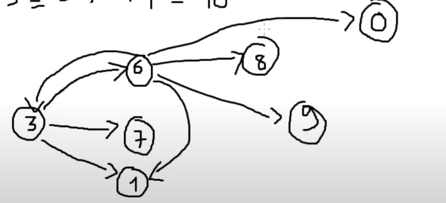
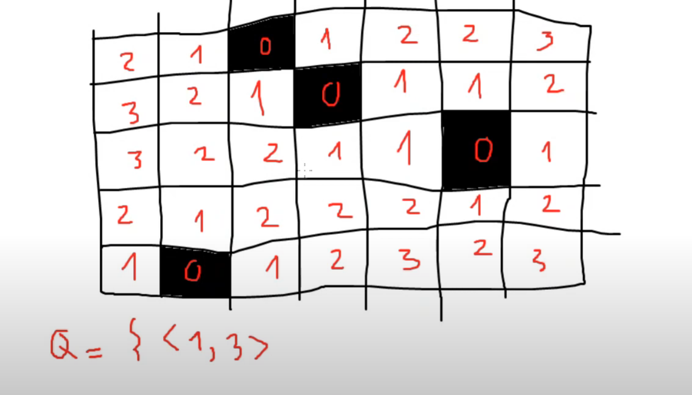
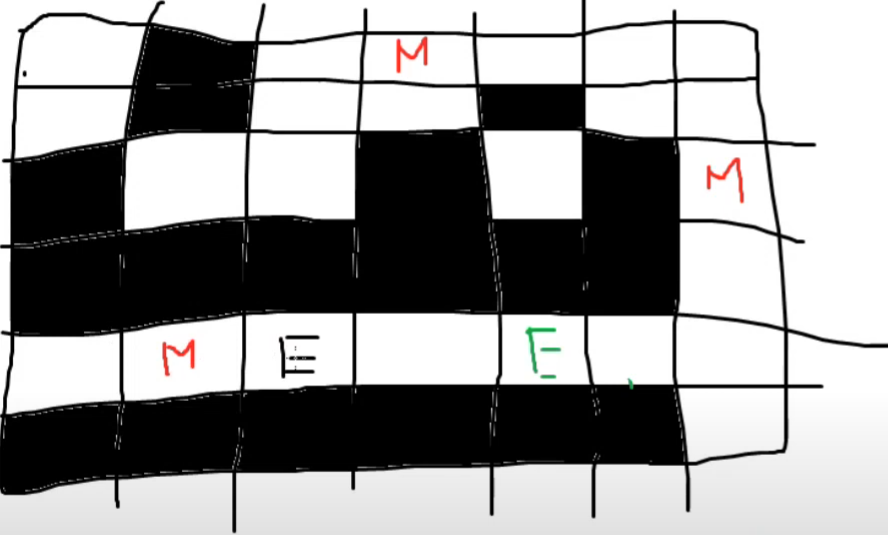
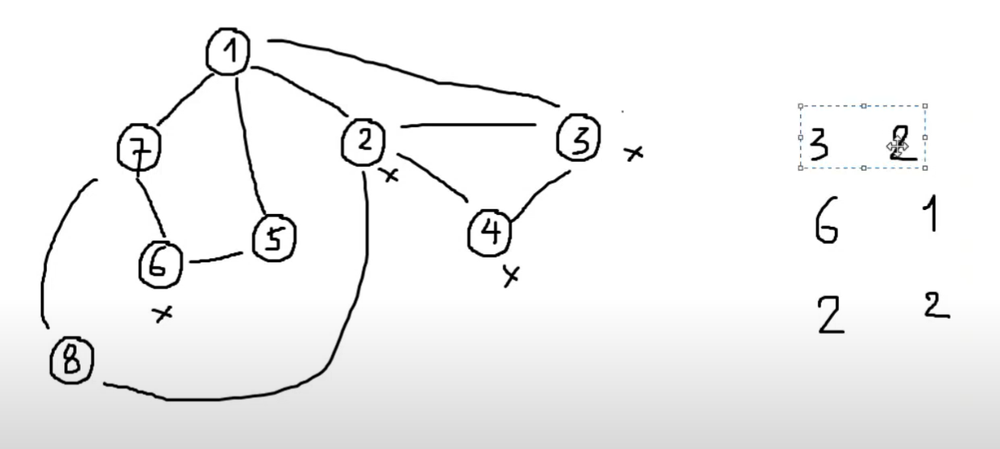

# BFS

Cho đồ thị {G, E}, xuất phát từ start. Độ dài đường đi ngắn nhất đến mọi đỉnh.  
Một đường đi ta tính độ dài bằng số cạnh trên đường đi đó.

---

## Ý tưởng

- Gọi `dist[u]` là độ dài của đường đi ngắn nhất từ start -> u.
- Khởi tạo `dist[u] = -1`.
- Chuẩn bị một hàng đợi (queue) để lưu trữ các đỉnh trong quá trình duyệt.
- Lưu start vào hàng đợi, `dist[start] = 0`.

Với đỉnh u trong queue, xét mọi v kề với u:

- Nếu `dist[v] == -1`:
  - `dist[v] = dist[u] + 1`
  - Đưa v vào queue

Xuất các `dist[u]`.

---

## Mã giả BFS

```plaintext
Khởi tạo các dist[u] = -1
dist[start] = 0
đưa start vào Q

while Q khác rỗng:
    lấy u ra khỏi Q
    duyệt mọi v kề u:
        nếu dist[v] == -1:
            dist[v] = dist[u] + 1
            đưa v vào Q
```

Độ phức tạp: O(V + E)

---

# MOVE

Cho 2 dãy số nguyên a và b. Ban đầu có một giá trị S.  
Được phép thực hiện nhiều thao tác như sau:

- Chọn một vị trí i, lấy S = (S \* a[i] + b[i]) % M

Hỏi sau tối thiểu bao nhiêu phép thì S sẽ trở về 0 hoặc đưa ra kết luận là không thể làm.

## 

## Ví dụ

```
5 2 1
2 1
3 1
```

a = [2, 3]  
b = [1, 1]

---

## Mã giả MOVE

```plaintext
Khởi tạo dist[i] = -1 với mọi i: 0 -> M-1
đưa S vào hàng đợi
dist[S] = 0

Lấy đỉnh u ra khỏi hàng đợi
duyệt mọi v kề u:
    for i: 1 -> n
        v = (u * a[i] + b[i]) % M
        nếu dist[v] == -1:
            dist[v] = dist[u] + 1
            đưa v vào hàng đợi.
```

---

# Bitmap

Cho một bảng gồm 2 màu đen và trắng.  
Với mỗi ô (i, j), hãy tìm ô màu đen gần ô này nhất và tính khoảng cách giữa 2 ô.

- Khoảng cách giữa ô (x1, y1) đến (x2, y2) được định nghĩa bằng khoảng cách Manhattan:  
  `|x1 - x2| + |y1 - y2|`

## 

# Monster



- Giống bài trên.
- Thêm: khi loang quái vật đến người không cần đè quái vật lên người vì người không thể đi qua quái vật được.

---

# Blue Grap

Cho đồ thị vô hướng n đỉnh, m cạnh.  
Các node là màu trắng.  
Task: tô một số node thành màu xanh, thỏa mãn q yêu cầu:

- Yêu cầu i: khoảng cách ci -> node xanh gần nhất = di

Giới hạn:  
`1 < q, n < 5.10^5; 0 < m < 5.10^5`



Ví dụ:

```
n=7 m=8 q=3
u v
1 2
2 3
3 4
4 1
4 5
5 6
6 4
5 7
ci di
7 2
4 1
2 1
```

---

## Ý tưởng

- `{ci, di}`; sort theo di giảm dần trong pq (max_heap)
- Đánh dấu các ci là trắng.

```plaintext
while stack != empty():
    duyệt vi kề ci
        nếu là trắng: bỏ qua
        nếu chưa tô:
            màu -> trắng
            di -> di-1
            thêm vào stack
```

Thêm BFS duyệt từ các ô xanh để tìm đường đi ngắn nhất đến tất cả các node.  
Kiểm tra xem các ci có thỏa mãn không.
