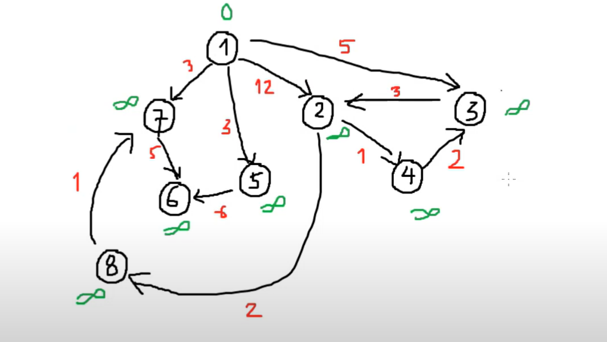
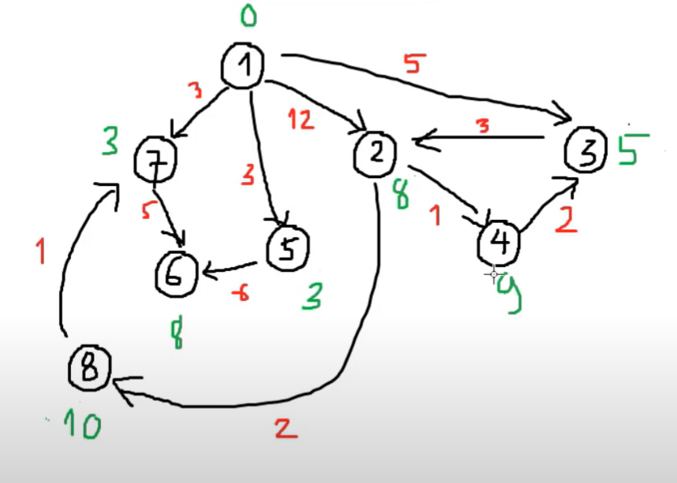
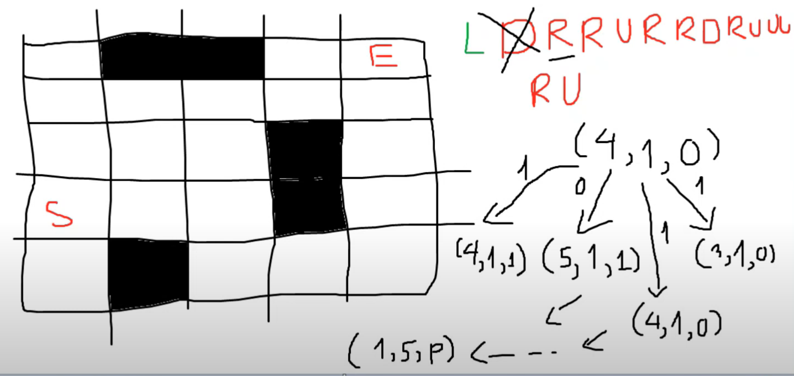
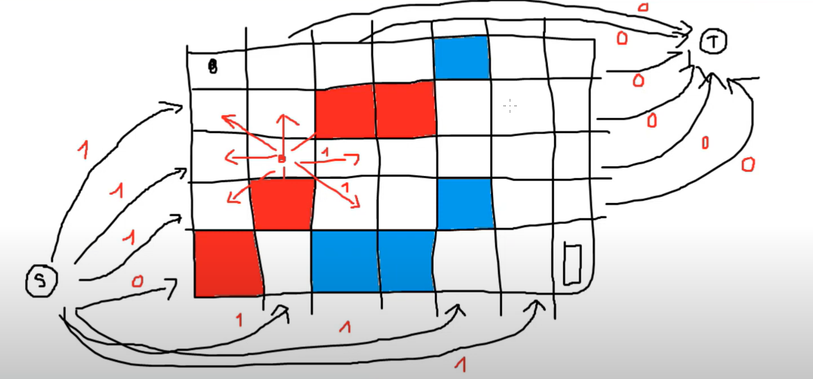

# Thuật toán Dijkstra

Cho một đồ thị có hướng G = (V, E).  
Trọng số trên đồ thị phải là trọng số không âm.

Cho một đỉnh xuất phát, hỏi độ dài đường đi ngắn nhất từ đỉnh này đến mọi đỉnh còn lại trong đồ thị.

---

## Ý tưởng thuật toán Dijkstra



- Gọi `dist[i]`: độ dài đường đi ngắn nhất từ đỉnh start đến đỉnh i.
- Sử dụng min-heap lưu `<độ dài, đỉnh>`.
- Khởi tạo:  
  `dist[i] = inf` với mọi i,  
  `dist[start] = 0`.
- Khi lấy một đỉnh u ra khỏi hàng đợi pq, xét các đỉnh v kề với u:
  - Nếu `dist[v] > dist[u] + w(u, v)`:
    - Gán `dist[v] = dist[u] + w(u, v)`
    - Đưa `<dist[v], v>` vào pq.

---

### Dijkstra (C++)

```cpp
// dijstra
pq.emplace(0, start);
while (!pq.empty())
{
    auto [d, u] = pq.top();
    pq.pop();
    if (d > dist[u])
        continue;
    for (auto [v, w] : adj[u])
        if (dist[v] > dist[u] + w)
        {
            dist[v] = dist[u] + w;
            pq.emplace(dist[v], v);
        }
}
```



---

## traffic

- Có n thành phố, m đường. Tìm đường đi ngắn nhất từ s -> t.
- Có thể xây thêm 1 đường trong k đường dự định.

**Công thức:**

- `minpath = dist[u] + w(u, v) + rdist[v]`  
  hoặc  
  `minpath = dist[v] + w(u, v) + rdist[u]`

---

## BuggyRobot



---

## BattleOfHowarts


