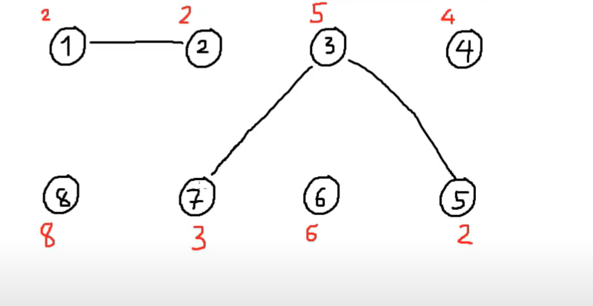
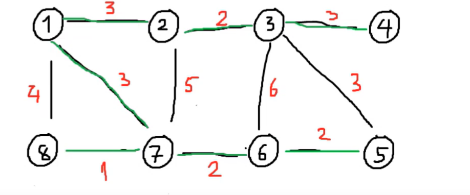
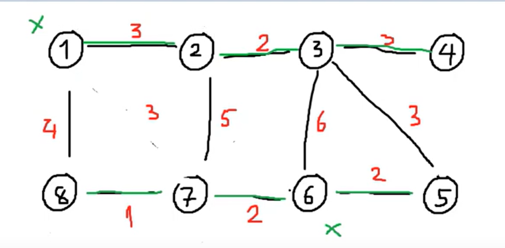

# DSU (Disjoint Set Union)



Tạo một mảng `root[u]` với ý nghĩa:

- `root[u]` là đỉnh đại diện "tạm thời" của thành phần liên thông có chứa u.

Khởi tạo:

- `root[i] = i`

---

## Hàm tìm gốc

```cpp
int findRoot(u) {
    return (root[u] = (root[u] == u) ? u : findRoot(root[u]));
}
```

---

## Duyệt mọi truy vấn u - v

```cpp
void unionSet(int u, int v)
{
    int rootu = findRoot(u);
    int rootv = findRoot(v);
    if (rootu != rootv)
    {
        cnt_union--;
        root[rootu] = rootv;
    }
}
```

---

### u và v có phải tplt

---

```cpp
    (findRoot(u) == findRoot(v))? "YES": "NO"
```

---

## AnasiCobweb

### đề bài

N đỉnh m cạnh. Q truy vấn: mỗi truy vấn bỏ 1 cạnh. in ra số tplt mỗi khi thực hiện 1 thao tác

```
n=4 m=4
1 2
2 3
1 3
3 4
q=3
2 4 3
```

ý tưởng: thay vì bỏ các cạnh đi ta thêm các cạnh vào.

```
unionSet bỏ qua cạnh {2,4,3}
    - xét union: tương đương với xóa cạnh {2, 4, 3}
    - thêm cạnh 3: tương đương với xóa cạnh {2, 4}
    - thêm cạnh 4: tương đương với xóa cạnh {2}
```

---

## Road Repairation


cho n đỉnh, m cạnh. tìm cây khung nhỏ nhất (Kruskal: cây khung nhỏ nhất). - duyệt cạnh tăng dần (u-v):
nếu u-v không liên thông. thêm vào tplt

## WC3 (Winter Contest 2020)

cho n máy tính, m dây. k máy tính đã có dữ liệu. tìm chi phí tối thiểu



Gọi `state[u]` với ý nghĩa:

- `state[u] = 1`: đỉnh u đã ở trong thành phần liên thông mà có 1 máy tính đã có dữ liệu.
- `state[u] = 0`: thành phần liên thông của u chưa có dữ liệu.

---
