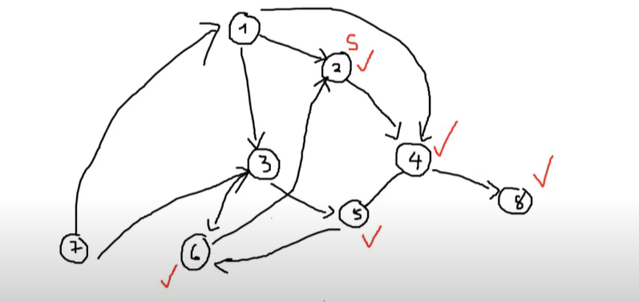
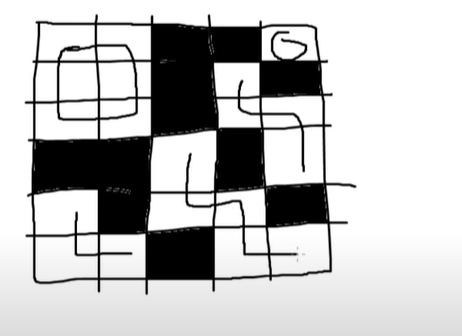
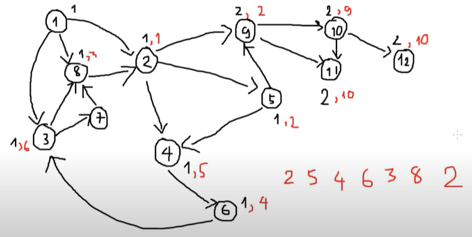

# Đồ thị

Đồ thị là một tập hợp các đỉnh và các cạnh, trong đó các cạnh biểu thị mối liên quan giữa các đỉnh với nhau.  
Một đỉnh được coi là một trạng thái của một sự vật, sự việc nào đó.

## Một số khái niệm căn bản trong đồ thị

1. **Đỉnh**: Một sự vật/sự việc/trạng thái
2. **Cạnh**: Biểu thị mối liên quan giữa 2 đỉnh với nhau, cạnh có hướng và cạnh vô hướng
3. **Trọng số của một cạnh**: Một giá trị được gán trên một cạnh biểu thị cho một giá trị nào đó trong bài toán
4. **Đường đi**: Một danh sách các đỉnh x1, x2, x3, ..., xk trong đó 2 đỉnh xi, xi+1 sẽ kề nhau (có một cạnh nối từ xi -> xi+1)

---

## Thuật toán DFS

hình ảnh minh họa 
Cho một đồ thị G(V,E), cho một đỉnh xuất phát bất kỳ, hỏi có bao nhiêu đỉnh có thể đến được nếu ta xuất phát từ đỉnh start.

Giả sử ta đang đứng tại đỉnh u, xét những lựa chọn v có thể đi đến được. Nếu v chưa được thăm thì hãy đến đỉnh v.  
Ta sử dụng một bảng `visited[u]` với ý nghĩa nếu `visited[u] = true` thì u đã được ghé thăm, = false nếu chưa được.

Để lưu trữ đồ thị ta sẽ sử dụng cấu trúc dữ liệu được gọi là danh sách kề:  
Một danh sách kề: `adj[u]` sẽ chứa các đỉnh v mà từ u có thể đi trực tiếp sang v.

Biểu diễn lưu trữ trong code:

```cpp
vector<int> adj[100005]; // nhập adj[u].push_back(v);
bool visited[100005];
```

Duyệt các vị trí có thể đi:

```plaintext
dfs(u): di chuyển từ vị trí u
    đánh dấu u đã thăm;
    duyệt v kề u
        nếu v chưa thăm
            dfs(v);
```

---

## Counting Room

ảnh minh họa 

Gọi `visited[i][j]` là đỉnh đã được thăm chưa  
`Dx[4]={0,0,1,-1}`  
`Dy[4]={1,-1,0,0}`

u = (x, y) và v = (nx,ny)
xét kề:
(nx,ny)=(x+dx[i], y+dy[i])

```plaintext
dfs(u)
    đánh dấu u đã thăm;
    for v kề u
        nếu v là '.' và chưa thăm
            dfs(v)
main()
    for i:0->n-1
        for j:0->m-1
            nếu  a[i][j]=='.' và chưa thăm a[i][j]
                ans++;
                dfs(i,j);
```

---

## Kiểm tra mê cung có thỏa mãn không

Một mê cung thỏa mãn khi và chỉ khi có duy nhất 1 lối vào và 1 lối ra, trong đó lối vào và lối ra phải nằm trên đường biên và có đường đi từ lối vào và rời khỏi lối ra.  
Hai đỉnh (x, y) và (x', y') kề nhau nếu chúng chung cạnh.  
Hỏi mê cung có thỏa mãn hay không.

Ví dụ:

```
##.##
##..#
#..##
##.##
```

---

## Round Trip II

### Đồ thị DAG

Đồ thị DAG là đồ thị có hướng và không tồn tại một chu trình đơn.

Một chu trình là một danh sách các điểm s -> s1 -> s2 -> ... -> sn -> s.



Gọi bảng `trace[u]` với ý nghĩa:  
`trace[u]` là đỉnh v kề trước đỉnh u trong quá trình duyệt DFS.

Gọi bảng `state[u]` với ý nghĩa:

- `state[u] = 0`: đỉnh u chưa được thăm
- `state[u] = 1`: đỉnh u đã được thăm và chưa kết luận được u không có chu trình
- `state[u] = 2`: đỉnh u đã được thăm và ta kết luận nếu đi vào u thì sẽ không tìm ra chu trình

```plaintext
dfs(u)
    state[u]=1
    for mọi v kề u
        nếu state[v]=0;
            trace[v]=u
            dfs(v)
        nếu state[v]==1
            truy vết đường đi và dừng chương trình
    state[u]=2
```

---

## Mail Delivery

### Bậc của đồ thị

Bậc của đồ thị (degree) là một giá trị đại diện cho số lượng đỉnh kề với đỉnh đang xét.

**Định lý Euler:**  
Một đồ thị G(V,E) sẽ tồn tại đường đi Euler nếu bậc của tất cả các đỉnh là số chẵn.

```plaintext
dfs(u)
    ans.push_back(u)
    for v kề u
        xóa v khỏi danh sách adj[u]
        xóa u khỏi danh sách adj[u]
        dfs(v)
```

Cài đặt `adj[u]` và `adj[v]` là 2 set.  
Đọc cạnh u-v  
Gọi `adj[u].insert(v)` và `adj[v].insert(u)`

---

## SC5

Trong một căn phòng thí nghiệm, ta có thể xem căn phòng này như một hình chữ nhật gồm N hàng, M cột.  
Trong đó ô (i, j) có thể rỗng ('.'), ô tường ('#'), ô có hồ nước ('S') và ô có độc ('1', '9').  
Ban đầu nhà khoa học ở ô (1,1) và thoát hiểm ở ô (N,M).  
Nếu nhà khoa học bước vào ô có độc, độc trong người tăng một lượng bằng độc nơi đó.  
Nếu nhà khoa học bước vào hồ thì toàn bộ độc được rửa sạch.  
Ô start và end không có độc, lượng độc >=10 thì mất mạng.  
Hỏi: nhà khoa học có thoát ra được căn phòng hay không.

Ví dụ:

```
n=3, m=6
.#####
.1234S
#####.
```

Ta tổ chức đồ thị như sau:  
Một đỉnh của đồ thị sẽ chứa 3 thông tin: {x, y, pos} với ý nghĩa nhà khoa học đứng tại ô (x, y) có lượng độc trong người là pos.  
Nhà khoa học sẽ xuất phát tại đỉnh (1,1,0).

Gọi `visited[x][y][pos]` true nếu đã được thăm và false khi ngược lại.  
Đỉnh xuất phát: (1,1,0)  
Đích đến: (n,m,pos) với pos < 10

```plaintext
dfs(x,y,pois)
    visited[x][y][pois]=true;
    for mọi (nx,ny) kề với (x,y)
        nếu !(0<nx<=n) || !(0<ny<=m)  || (nx,ny) == '#'
            continue;// tạo bao tường thì chỉ xét '#'
        nếu (nx,ny) is digit
            pois + a[nx,ny]>=10
            continue
        nếu (nx,ny)=='S'    pois=0
        nếu (nx,ny) is digit pois += a[nx,ny]
        nếu visited[nx][ny][pois]==false
            dfs(nx,ny,nextpois);
```
