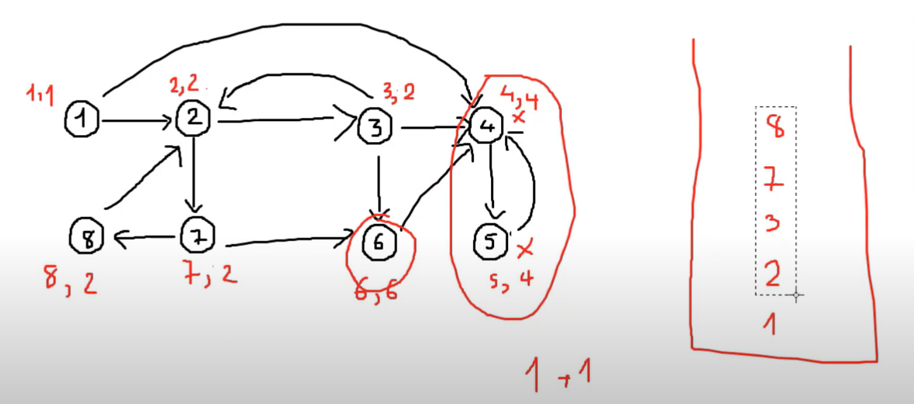
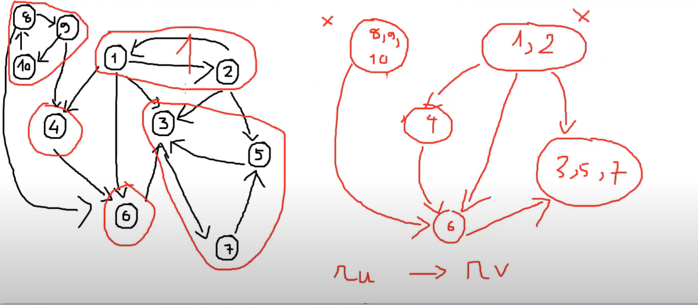
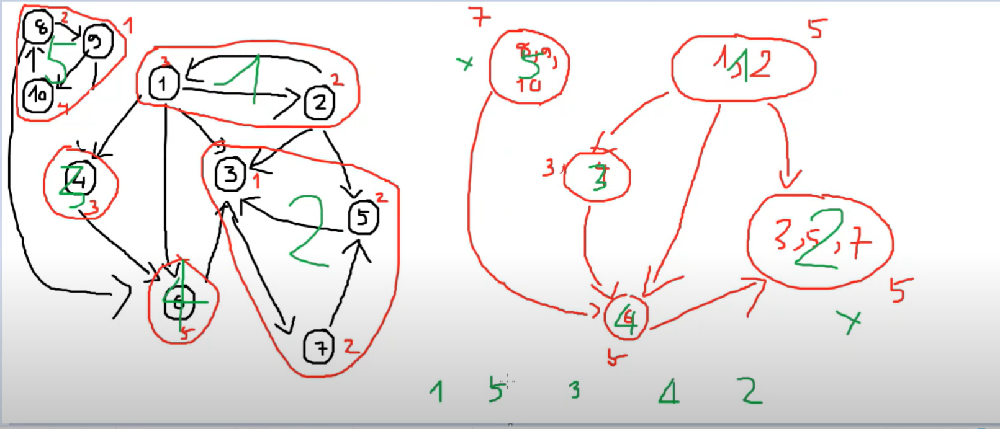

# Thành phần liên thông mạnh

Cho một đồ thị có hướng G(V, E), một **thành phần liên thông mạnh** là một tập hợp các đỉnh trong đồ thị đó sao cho với bất kỳ 2 đỉnh nào trong tập hợp đó đều có thể di chuyển được với nhau.

**Yêu cầu:**  
Hãy liệt kê ra các thành phần liên thông mạnh.



---

## Thuật toán Tarjan

### Bảng deleted[u]: hỏi đỉnh u đã được xóa khỏi đồ thị hay chưa?

Sử dụng stack.

```plaintext
dfs(u)
    timeDfs++
    numb[u] = low[u] = timeDfs
    đưa u vào stack
    duyệt mọi v kề với u
        nếu deleted[v] = true
            continue
        nếu numb[v] > 0:
            low[u] = min(low[u], numb[v])
        else:
            dfs(v)
            low[u]= min(low[u], low[v])
    nếu numb[u] == low[u]:
        ans++
        while true
            đặt v = stack.top()
            stack.pop()
            deleted[v] = true
            nếu v == u
                break
```

---

## Bài toán Message



Có N bạn học sinh và có M mỗi liên hệ giữa các bạn với nhau.  
Một mối liên hệ gồm 2 bạn u và v với ý nghĩa: bạn u có thể liên lạc cho bạn v.

Thầy giáo muốn giao bài tập cho N bạn, thầy giáo sẽ chọn một vài bạn để gửi bài tập, và nhờ những bạn này liên lạc những bạn còn lại để gửi bài tập, tiếp tục nhờ những bạn đó liên lạc các bạn khác, cứ thế...

**Hỏi:**  
Thầy giáo cần giao bài tập tối thiểu cho bao nhiêu bạn để toàn bộ N bạn đều có bài tập?

**Ý tưởng:**

- Dùng thành phần liên thông mạnh, coi mỗi phần là 1 nhóm.
- Đếm có bao nhiêu nhóm không có nhóm nào trỏ đến.

**Kết luận:**  
Trả về số lượng nhóm liên thông mạnh không có nhóm khác hướng tới.

---

## Bài toán Coin



Cho n phòng, m hầm, phòng i có p[i] coin.  
Max số coin có thể tìm được. Ban đầu có thể ở bất cứ phòng nào.

**Ý tưởng:**

- Những coin chung tplt là coi là chung 1 nhóm.
- Topo sort tìm đường đi thu hoạch nhiều tiền nhất (tương tự bài longest_path sử dụng quy hoạch động).
