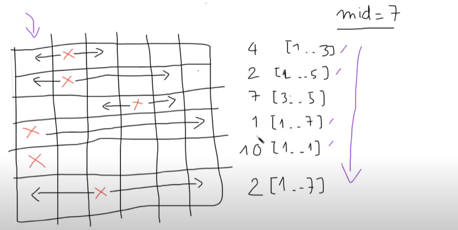

<!-- filepath: c:\Users\HP PC\ICPC\algo_course\Thang2\Readme\3.binary_search_on_answer.md -->

# Binary Search on Answer (Tìm kiếm nhị phân trên đáp án)

Ý tưởng chung: Khi câu trả lời thỏa mãn có tính đơn điệu (nếu một ngưỡng L thỏa thì mọi L' lớn hơn/nhỏ hơn cũng thỏa/không thỏa), ta có thể nhị phân trên đáp án.

---

## 1) Array Division (bsoa + gready)

Cho mảng a gồm N số nguyên dương và số nguyên dương k. Hãy chia a thành k dãy con LIÊN TỤC sao cho mỗi phần tử thuộc đúng 1 dãy con. Với mỗi dãy con, tính tổng của dãy con đó. Hãy chia để tổng lớn nhất trong k dãy là nhỏ nhất có thể.

- Ví dụ:

```text
N = 10, k = 3
a = [5, 3, 3, 1, 9, 2, 4, 4, 6, 3]
```

- Ràng buộc: 1 <= N <= 100000
- Nhận xét đơn điệu:

  - Nếu giới hạn L đã chia được (mỗi nhóm có tổng <= L) thì mọi L' > L cũng chia được.
  - Nếu giới hạn L không chia được thì mọi L' < L cũng không chia được.

- Khoảng tìm kiếm hợp lý:

  - lo = max(a) (ít nhất phải chứa phần tử lớn nhất)
  - hi = sum(a) (gộp tất cả vào 1 nhóm)
  - Dùng [lo, hi] hay [1 .. 2e14] đều đúng về mặt nhị phân, nhưng [max(a), sum(a)] nhanh hơn.

- Cách kiểm tra với một L: duyệt tuyến tính, cộng dồn thành nhóm, mỗi khi vượt L thì tách nhóm mới. Đếm số nhóm <= k thì "chia được".

- Ví dụ nhị phân:

```text
Range: [1 .. 50]
25: Chia được → ans = 25 → thu hẹp [1 .. 24]
12: Không chia được → [13 .. 24]
18: Chia được → ans = 18 → [13 .. 17]
15: Chia được → ans = 15 → [13 .. 14]
13: Không chia được → [14 .. 14]
14: Không chia được → [15 .. 14] → dừng → đáp án = 15
```

- Độ phức tạp: O(N log(sum(a) − max(a))).

---

## 2) Aggressive Cows

Có N cái chuồng, chuồng thứ i ở vị trí x[i]. Có C con bò, cần đặt mỗi con vào 1 chuồng sao cho khoảng cách giữa hai con gần nhau nhất là LỚN NHẤT.

```
n = 8, c=3
x,_,_,_,_,u,_u,_,_,_,u,x,_,_,_,_u,_,_,x,_,_,_,_u
```

- Nhận xét đơn điệu:

  - Với L đặt được C con thì mọi L' < L cũng đặt được;
  - nếu không đặt được thì mọi L' > L hơn cũng không đặt được.
  - L trong [1 .. 1e9] .

- Nhận xét: với khoảng cách L: đặt đc c bò cách nhau >= L không.
  - nếu được: ans = L, tìm L lớn hơn.

Độ phức tạp: O(N log range).

---

## 3) Move12 (phủ N cột bằng cảnh sát di chuyển tối đa T)



Nhận xét:

- nếu t phủ đc n cột thì t'>t cũng phủ đc n cột
- nếu t không phủ đc n cột thì t' < t cũng không phủ đc cột

Vậy nhị phân trên thời gian T.

- Giả sử:
  - 1 <= N <= 10000
  - police[i] = {c[i], time/ô}
  - move: số ô đi đc trong thời gian T(move = T / (time/ô))
- Với thời gian T, police[i] = [c[i] − move_i, c[i] + move_i].

=>Hỏi hợp nhất các khoảng này có phủ toàn bộ [1 .. N] không?

sử dụng minheap.

- minheap1: vị trí police.
- minheap2: vị trí cuối mà 1 police đến đc.

---

## 4) Max Median

Cho mảng a gồm N số nguyên, liệt kê tất cả dãy con có độ dài tối thiểu K và tìm median lớn nhất trong số đó.

- Ví dụ:

```text
a = [4, 1, 1, 2, 9, 3] → median = 2
 a sorted: [1, 1, 2, 3, 4, 9]

a = [4, 4, 1, 9, 1] → median = 4
 a sorted: [1, 1, 4, 4, 9]
```

- giả sử ta có trung vị ít nhất là M. tồn tại dãy (>= k) mà trung vị >= M không
- nhận xét: m càng lớn thì càng khó tìm đc, m càng nhỏ thì càng dễ tìm đc.
  - binary search on answer
- xét mid = M:

  - (số lượng < M ) < (số lượng >= M) thì thỏa mãn

  - đặt b[i] = 1: a[i] >= M; b[i] = -1: a[i] < M
    - nếu tổng l -> r > 0 thì thỏa mãn
  - đặt sum[i] = sum[i-1] + b[i];
    - sum[r] - sum[l-1] > 0 thì thỏa mãn.
    - đặt minL = min 1 -> r - k;

ví dụ:

```
    a = [1, 9, 2, 2, 6, 7, 10, 3, 3, 4]
    M = 6
    b = [-1, 1, -1, -1, 1, 1, 1, -1, -1, -1]
    sum =[-1,0,-1,-2,-1,0,1,-1,-2,-3];

```

---

Ghi nhớ: Tất cả các bài trên đều dựa vào tính đơn điệu của đáp án theo một tham số L/M/T và dùng kiểm tra tham lam/tuyến tính cho mỗi giá trị mid trong nhị phân.
