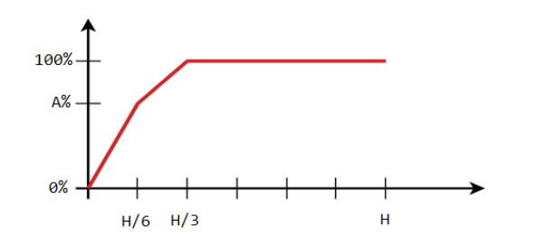

# Tìm kiếm nhị phân trên số thực và Tìm kiếm tam phân

---

## 1. Tìm kiếm tam phân (Ternary Search)

Tìm kiếm tam phân được sử dụng để tìm cực trị (cực đại hoặc cực tiểu) của một hàm số **unimodal** (đơn đỉnh). Hàm unimodal là hàm chỉ có một đỉnh, tức là nó tăng rồi giảm, hoặc giảm rồi tăng.

- **Ý tưởng:**
  Thay vì chia đôi đoạn tìm kiếm `[lo, hi]`, ta chia nó thành 3 phần bằng 2 điểm `u` và `v`.
  ```
  u = (2*lo + hi) / 3
  v = hi - (hi - lo) / 3
  // Hoặc: u = (2*lo + hi) / 3, v = (lo + 2*hi) / 3
  ```
- **Logic thu hẹp khoảng:**

  - **Tìm cực đại:**
    - Nếu `f(u) < f(v)`, đỉnh nằm trong `[u, hi]`. Ta gán `lo = u`.
    - Nếu `f(u) >= f(v)`, đỉnh nằm trong `[lo, v]`. Ta gán `hi = v`.
  - **Tìm cực tiểu:**
    - Nếu `f(u) < f(v)`, đỉnh nằm trong `[lo, v]`. Ta gán `hi = v`.
    - Nếu `f(u) >= f(v)`, đỉnh nằm trong `[u, hi]`. Ta gán `lo = u`.

- **Điều kiện dừng:**
  Lặp một số lần cố định (ví dụ: 100-200 lần) để đạt được độ chính xác mong muốn, vì so sánh số thực có thể không chính xác tuyệt đối.

---

## 2. Tìm kiếm nhị phân trên số thực (Binary Search on Floats)

Tương tự như tìm kiếm nhị phân trên số nguyên, nhưng điều kiện dừng là số lần lặp thay vì `lo <= hi`.

- **Vòng lặp:**
  ```cpp
  for(int i = 0; i < 100; ++i) {
      double mid = lo + (hi - lo) / 2;
      if (check(mid)) {
          ans = mid;
          hi = mid; // hoặc lo = mid tùy bài toán
      } else {
          lo = mid; // hoặc hi = mid
      }
  }
  ```
  Lặp 100 lần thường đủ để đạt độ chính xác `10^-9` vì `(1/2)^100` là một số rất nhỏ.

---

## Các bài toán ví dụ

### a) Rate (Binary Search on Floats)

**Bài toán:** Cho mảng `a` gồm `N` số. Tìm trung bình cộng lớn nhất của một dãy con bất kỳ có độ dài tối thiểu `K`.

---

**Nhận xét:** Trung bình cộng (`avg`) càng lớn, càng khó tìm được dãy con thỏa mãn. Đây là tính chất đơn điệu, có thể áp dụng tìm kiếm nhị phân trên `avg`

---

phân tích:

```

(a[1] + a[1+1] + ... +a[r]) / (r - L + 1)>= avg

==> (a[l] - avg) + (a[l +1] - avg) + .... + (a[r] - avg) >= 0

đăt B: b[i] = a[i]-avg

    b[1] + b[1 + 1] + .... + b[r] >= 0
    == > một đoạn [l .. r] có tổng >= 0

đặt sum: sum[i] = sum[i-1] + b[i]

sum[r] - sum[1 - 1] >= 0

== > tìm sum[r] >= sum[l]

minL: min 1 -> r - k;

Với sum[i], ta so sánh sum[i] >= minL hay không
```

### b) Martian Programmer (Hiệu suất công việc)



- **Bài toán:** Một ngày có `H` giờ. Hiệu suất làm việc phụ thuộc vào số giờ ngủ `x`:
  - `x = 0`: hiệu suất 0%.
  - `0 -> H/6`: tăng đều từ 0% -> A%.
  - `H/6 -> H/3`: tăng đều từ A% -> 100%.
  - `x > H/3`: hiệu suất 100%.
    Tìm độ hiệu quả công việc cao nhất, biết **Độ hiệu quả = (Khả năng làm việc) \* (Số giờ thức)**.
- **Phân tích:**
  - Gọi `x` là số giờ ngủ. Số giờ thức là `H - x`.
  - Gọi `f(x)` là hàm khả năng làm việc (%).
  - Ta cần tối ưu hàm `g(x) = f(x) * (H - x)`.
  - Hàm `f(x)` là hàm tăng và `H-x` là hàm giảm. Tích của chúng thường tạo ra một hàm unimodal (tăng đến đỉnh rồi giảm).
- **Giải pháp:** Dùng tìm kiếm tam phân trên số giờ ngủ `x` trong khoảng `[0, H]`.
  - `lo = 0, hi = H`.
  - Tính `u = (2*lo+hi)/3`, `v = (lo+2*hi)/3`.
  - So sánh `g(u)` và `g(v)` để thu hẹp khoảng tìm kiếm `[lo, hi]` cho đến khi đủ chính xác.

### c) Race Time

Ta thấy `f(T) = max(Pi(T)) - min(Pi(T))`

Nếu người chạy nhanh nhất (Si lớn nhất) bị xuất phát chậm nhất và người chạy chậm nhất (Si bé nhất) và xuất phát xa nhất cùng chạy trong 1 khoảng thời gian T.

Ta áp dụng **Ternary search**

Với thời gian `u` và `v`, thì ta tính `f(u)` và `f(v)`, trong đó `f(x)` tính như sau:

- Ta tạo ra mảng P với ý nghĩa `Pi(x) = Di + x * Si`
- Ta duyệt tìm số lớn nhất trong P và số nhỏ nhất trong P => `f(x) = số lớn nhất - số nhỏ nhất`

Ta so sánh `f(u)` và `f(v)`:

- **Trường hợp 1:** `f(u) < f(v)` => điểm cực tiểu nằm trong đoạn từ `[lo .. v]` => gán `hi = v`
- **Trường hợp 2:** `f(u) > f(v)` => điểm cực tiểu nằm trong đoạn từ `[u .. hi]` => gán `lo = u`

### d) Weakness And Poorness

- **Bài toán:**

  - Cho dãy: a1, a2, ..., an.
  - Tìm số thực x sao cho dãy mới: b1 = a1 - x, b2 = a2 - x, ..., bn = an - x có weakness nhỏ nhất.
  - Định nghĩa weakness: weakness = max poorness, với poorness = |sum\_{i->j}| trên mọi đoạn con [i, j].

- **Nhận xét:**

  - Khi x tăng từ âm vô cực đến dương vô cực
  - Có thể áp dụng tìm kiếm tam phân trên x.

- **Thuật toán:**

  - Đặt lo = -10005, hi = 10005 (giá trị đủ lớn để bao phủ mọi trường hợp).
  - Với mỗi giá trị x, tính weakness như sau:
    1. Đặt b[i] = a[i] - x
    2. Tính mảng tổng tiền tố: sum[i] = sum[i-1] + b[i]
    3. poorness của đoạn [l, r] là |sum[r] - sum[l-1]|, weakness là giá trị lớn nhất này trên mọi đoạn.
    4. Duyệt i từ 1 đến n:
       - Duy trì minSum, maxSum của các sum[j] với j < i
       - `weakness = max(weakness, sum[i] - minSum, maxSum - sum[i])`
       - Cập nhật minSum, maxSum
    5. Ban đầu: minSum = maxSum = sum[0] = 0

- **Ternary search:**

  - Đặt u = (2 _ lo + hi) / 3, v = (lo + 2 _ hi) / 3
  - So sánh f(u) và f(v):
    - Nếu f(u) < f(v): cực tiểu nằm trong [lo, v] → hi = v
    - Nếu f(u) > f(v): cực tiểu nằm trong [u, hi] → lo = u

- **Tóm tắt công thức:**

```cpp
b[i] = a[i] - x
sum[i] = sum[i-1] + b[i]
poorness = |sum[r] - sum[l-1]|
weakness = max |sum[r] - sum[l-1]| trên mọi đoạn [l, r]
```
